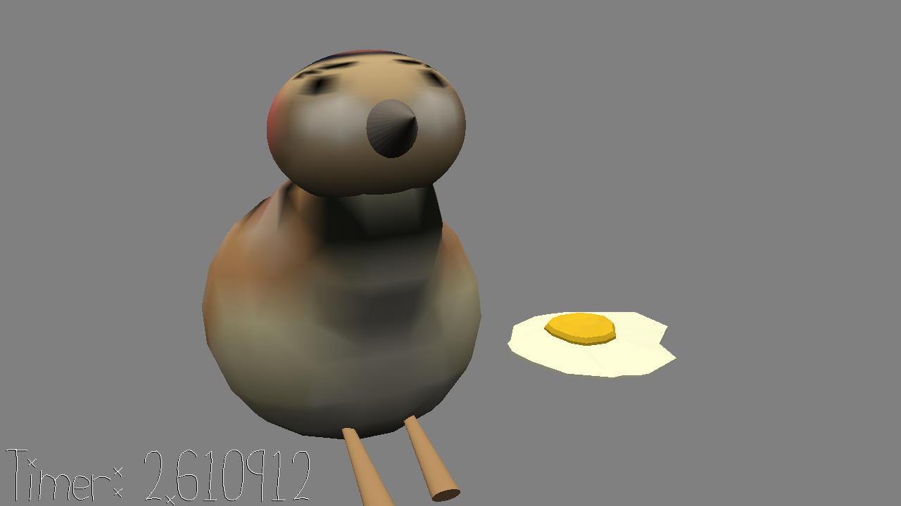

# (TODO: your game's title)

Author: (TODO: your name)

Design: (TODO: In two sentences or fewer, describe what is new and interesting about your game.)

Screen Shot:

How To Play:

(TODO: describe the controls and (if needed) goals/strategy.)

Sources: (TODO: list a source URL for any assets you did not create yourself. Make sure you have a license for the asset.)
- "Bird Whistling, Robin, Single, 13.wav" by InspectorJ (www.jshaw.co.uk) of Freesound.org. Link here: https://freesound.org/people/InspectorJ/sounds/456440/
- game over link here: https://freesound.org/people/noirenex/sounds/159408/
- bg: https://freesound.org/people/itsmochajones/sounds/530294/

This game was built with [NEST](NEST.md).

